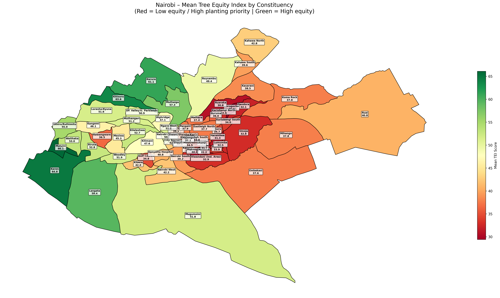
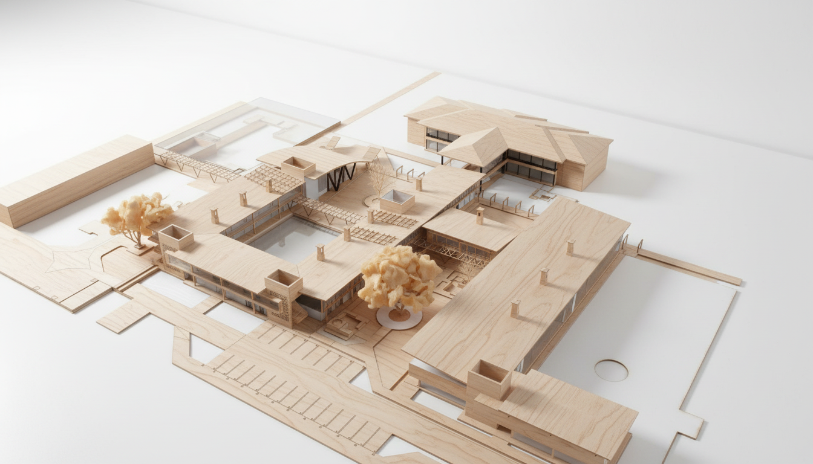
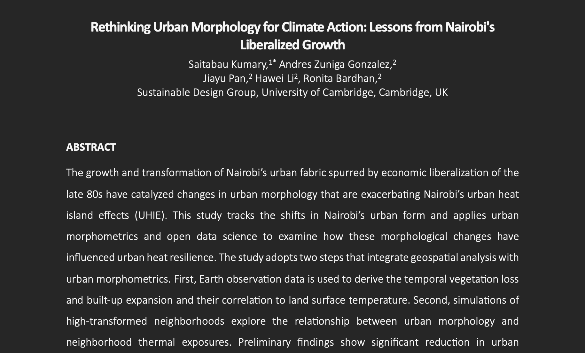
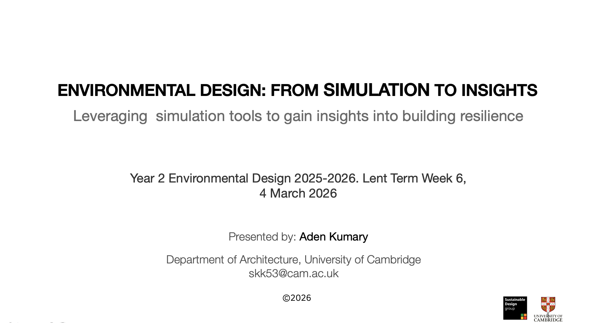
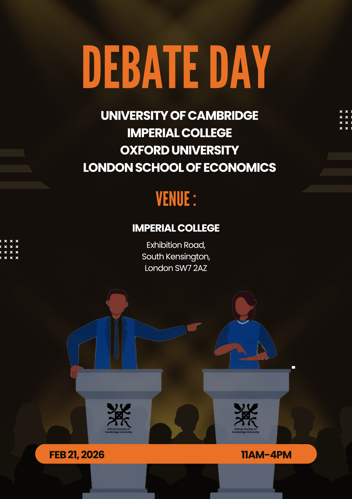

The past two weeks have been intense but incredibly rewarding. I’ve been juggling three major commitments, all orbiting around my research.

First, I presented at two conferences: the American Association of Geographers and the Jesus College MCR Conference. In between, I gave a 20-minute Chalk Talk to the MCR community—sharing my project in a more informal, discussion-driven setting. (For context, the MCR—Middle Combination Room—is essentially the postgraduate counterpart to the undergraduate JCR a space where ideally postgradute students interact.)

But beyond the presentations, the real story lies in the work itself.

**Mapping Trees in a Growing City**

A big part of my recent work has focused on Nairobi—specifically, understanding how urban growth is reshaping its environmental landscape.

One of the key tools I developed is a Tree Equity Index (TEI). The idea is simple in principle but quite involved in practice. I started by extracting built-up areas using the Global Human Settlement Layer dataset, then divided the city into 100 m grids. On top of this, I overlaid tree canopy data from the Dynamic World and ESA WorldCover datasets.

The result? A spatial estimate of how tree cover is distributed across Nairobi’s built environment.

**Heat, Inequality, and the Urban Fabric**

From there, I moved on to analysing the Urban Heat Island (UHI) effect across settlement areas,essentially mapping where heat is most concentrated in the city.

The next step (already underway) is to statistically explore the relationship between UHI, tree equity, and built-up density. Alongside this, I’ve been developing heat risk maps for Nairobi’s wards, as well as corresponding tree equity maps. (Full disclosure: I actually completed this part earlier—I just never got around to publishing this write-up.)

I’m also working on what I’m calling **a Greeness Index**. This takes a slightly different angle: instead of just measuring where green space exists, it asks how accessible it is. By mapping all public parks and calculating walking times to reach them, I hope to capture how easily residents can access open, green spaces in their daily lives.

**Why This Matters**

My research centres on building thermal resilience—but I’ve come to realise that this can’t be done in isolation. To design meaningful interventions, we need a broader understanding of the urban system.

Urban Heat Island hotspots, for instance, are not just warmer—they are more vulnerable. During heatwaves, these areas become points of acute stress, making them priority targets for mitigation strategies. The same applies to tree cover: the Tree Equity Index highlights where greening efforts are most urgently needed.

**A City of Uneven Landscapes**

What’s become increasingly clear is that heat and greenness are not evenly distributed. The maps are clear heat is not a physical phenomenon but a social one too.

Hotter areas tend to coincide with informal settlements and socioeconomically deprived neighbourhoods. These same areas often have less tree canopy and poorer access to public green spaces. In other words, the people most exposed to extreme heat are also those with the fewest natural buffers against it.

**The Scale of Change**

Perhaps most striking is the pace of Nairobi’s expansion.

In 1975, the city’s built-up area covered roughly 48 km². By 2025, this has more than doubled to around 103 km much of it is urban sprawl and uncontrolled densification. This rapid growth has come at a cost: the loss of urban greenery and the spread of impervious surfaces, both of which intensify the Urban Heat Island effect.

There’s still more to explore, especially as I move into deeper statistical analysis but one thing is already clear: understanding how cities grow, heat up, and green (or don’t) is essential if we’re serious about building climate-resilient urban futures, more importantly for the rapidly growing African cities.

1. **HAAD Project**

 News time! Happy to officially mention that I was among the 10 finalists of a design competition titled “Heat Adaptive Architecture Design (HAAD),” which was held sometime between July and November last year(2025). The competition aimed to encourage adaptive thinking among architecture students for today’s climate challenges. The task was to envision an innovative building design that can adapt to extreme future weather events, particularly extreme heat and heatwaves.

The whole of last week, I was working on the second stage of the design, where I refined my ideas with guidance from a mentor. My mentor suggested that I critically assess the materiality of the project. Unfortunately, I had to take a few steps back to remodel the entire project in a way that would make it 3D-printable, which consumed quite a bit of time. Thankfully, I was able to complete it. Below is an Maquette of the project. I will put up a poster about it very soon.

2. **Conference Paper**

I started writing my conference paper titled “Rethinking Urban Morphology for Climate Action.” The research focuses on the double jeopardy posed by rapid urbanisation and climate change. Over the past two weeks, I have created a heatwave prediction map for Kenya and used WorldPop data to map Nairobi’s urbanisation over the last two decades. I also modified code to compute NDVI, LST, VHI, and UTFVI, although this is still a work in progress.

I have begun drafting the manuscript by outlining the introduction, methodology,literature review and  mainly focusing on organizing my thoughts on paper. For the next three weeks, I will dedicate my full attention to this project. I am also excited to return to working on CFD simulations.

3. **Advanced Geospatial Analysis**

In the evenings, I have been taking geospatial classes where we explored R-Studio to analyse and visualise geospatial data. I have gained valuable insights into applying different R packages such as tmap, Leaflet, and tools for data manipulation.
I am yet to sit down and thoroughly review my notes and projects. Once I do, I plan to write a separate blog post about the experience. Many thanks to Dr. Nanki Sidhu for organising the training materials and guiding us through the course.

4. **My First Lecture**

This Lent term, I will be giving a lecture to second-year architecture students on the application of environmental tools in research. I have spent some time preparing for this, as the lecture is scheduled for early March, and I need to have the materials ready for sharing.

In the lecture, I will present part of my PhD work, demonstrating how platforms such as Google Earth Engine (GEE) can be used for geospatial and remote sensing analysis, alongside computational simulation tools such as the Ladybug and Honeybee plugins for Grasshopper. These tools can help assess building performance and resilience under current and projected climate conditions.

I am excited and looking forward to the lecture.

 <h2>5.ASCU Posters</h2>

When I am not working on my PhD, I serve as the Communications Officer for African Society of Cambridge University. 
I mainly design posters for the society’s upcoming events. Below are some of the posters I have designed.

  

  

  

  

  

