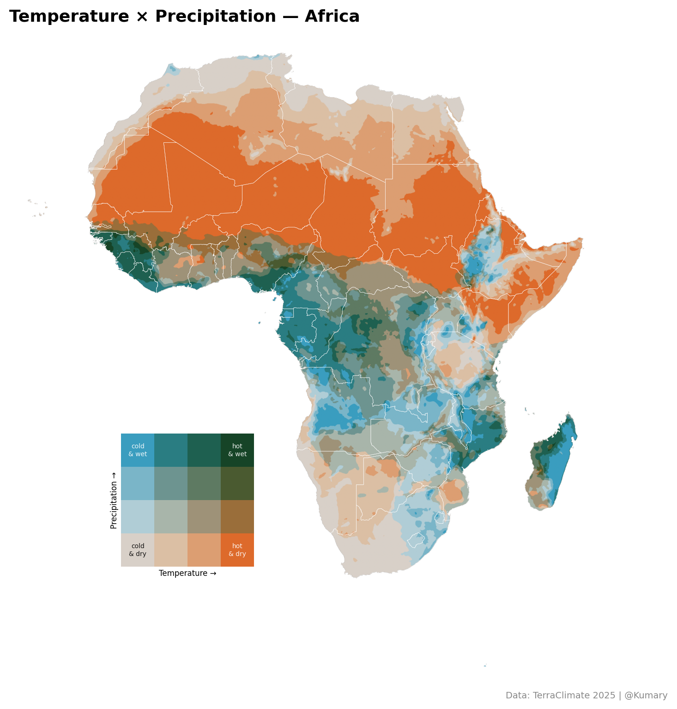
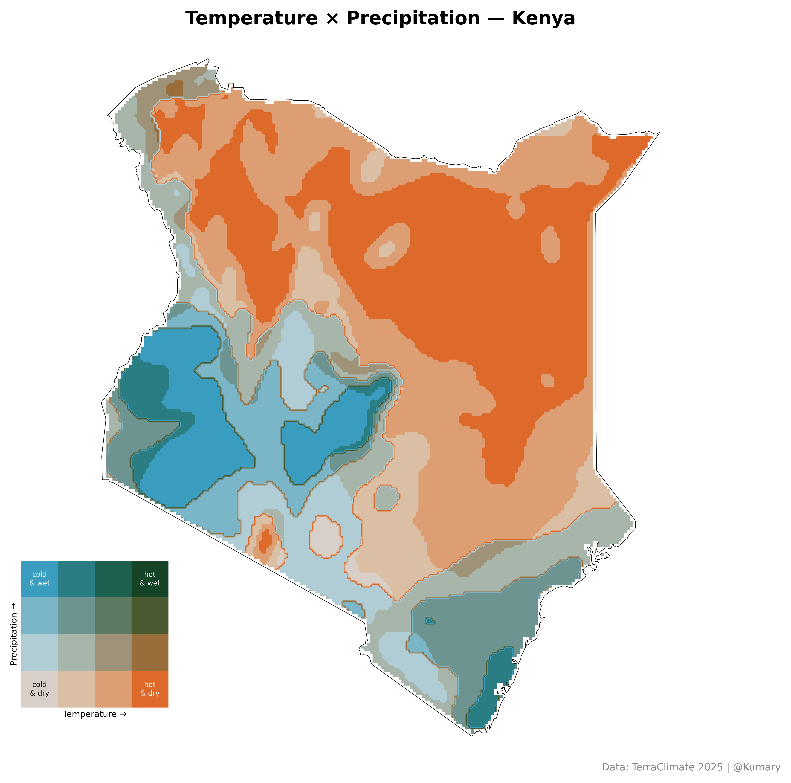

Visualizing climate data usually means looking at two separate maps: one for how hot it is and another for how much it rains. But the real story lies in how these two variables dance together. As part of my recent upskilling journey, I used TerraClimate 2025 data to create Bivariate Choropleth Maps for Africa and Kenya, offering a unique perspective on regional climate patterns.

**Why Bivariate?**

A standard map tells you "it’s dry here." A bivariate map tells you "it’s dry and scorching" versus "it’s dry and cool." By using a two-dimensional color matrix, we can visualize the relationship between Maximum Temperature ($T_{max}$) and Precipitation ($PPT$) simultaneously.

**The Workflow: From NetCDF to Visuals**

The process involves blending geospatial analysis with creative data visualization. Here’s a high-level look at the technical pipeline:
    

- **Data Acquisition**  
  Temperature and precipitation data were sourced from NetCDF files and processed using `xarray` and `rioxarray` for efficient geospatial handling.

- **Smoothing & Resampling**  
  A Gaussian filter was applied to reduce noise and improve overall map readability.

- **Quantile Classification**  
  Both datasets were divided into three terciles (*low*, *medium*, *high*) to represent relative climate conditions within the region.

- **Color Matrix**  
  The classified data were mapped onto a 3 × 3 grid:
  - *Low / Low* (cool & dry): pale tones  
  - *High / High* (hot & wet): deep, saturated colors  
  - *High temperature / Low precipitation* (hot & dry): high-contrast tones  

- **Masking**  
  Using `geopandas`, global datasets were clipped to the boundaries of Africa and Kenya for a clean, focused visual output.
  

**Key Takeaways**

Looking at the results, the contrast is striking. In the Africa map, you can clearly see the vast "Hot & Dry" expanse of the Sahara compared to the "Hot & Wet" tropical belt of the Congo Basin.

Switching to the Kenya map reveals even more granular detail—highlighting how topography influences these variables, from the humid coastal regions to the arid northern landscapes. This exercise wasn't just about coding; it was about finding a more nuanced way to tell the story of our changing climate.

Data Credit: TerraClimate 2025 | Tools: Python (Matplotlib, Xarray, Geopandas)

Tutorial:    Milan Janosov tutorial
