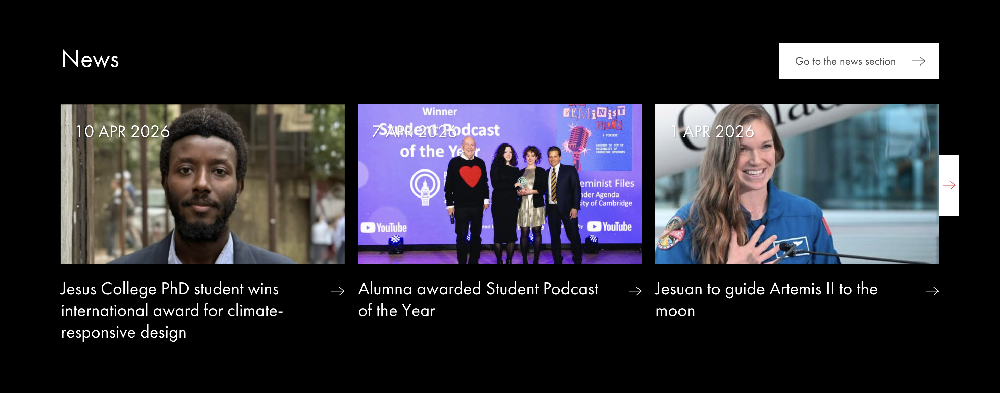
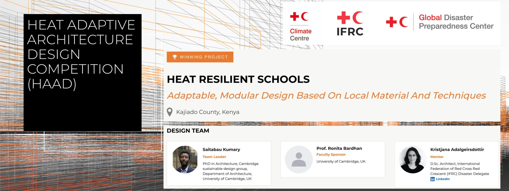

Remember this [HAAD](https://adenkumary.github.io/posts/2026-02-24-Febweek4blog.html){target="_blank"}? The  [Heat adaptive architecture design competition](https://preparecenter.org/site/heat-adaptive-architecture-design-competition/haad-meet-the-winners/){target="_blank"}

well I have exciting news for y'all. **I Won** yes you read that right, I won an international design competition. I am incredibly happy to announce that my design submission was considered as one of the winning entry in the heat adaptive architecture compeition.
my design solution envisions a learning institution designed for a warmer future in Kenya, where schools are often under-resourced and heatwaves are expected to increase in frequency, intensity, and severity. It draws on local design knowledge, materials, and technologies to create adaptive, climate-responsive schools. At a time when African countries must take proactive steps to address heat risks and climate adaptation, this approach offers a practical, affordable and sustainable path forward.
I am elated to have featured on my College website [here](https://www.jesus.cam.ac.uk/articles/jesus-college-phd-student-wins-international-award-climate-responsive-design){target="_blank"}, my research group linkedIn page  [here](https://www.linkedin.com/posts/camsustainabledesign_climatechange-heatadaptation-cambridgesdg-activity-7447219260898127872-1yxP?utm_source=share&utm_medium=member_desktop&rcm=ACoAAB6qta0BXH4Yj_EeeaFXAmUW5AOmjuxiRIU){target="_blank"} and the [Global disaster preparedness page](https://www.linkedin.com/posts/aynurkadihasanoglu_we-are-thrilled-to-announce-thethree-winning-share-7447170503108247552-MLVG?utm_source=share&utm_medium=member_desktop&rcm=ACoAAB6qta0BXH4Yj_EeeaFXAmUW5AOmjuxiRIU)

I want to formally appreciate [the global disaster preparedness centre](https://preparecenter.org/) for organizing the competition. [Prof. Ronita Bardhan](https://www.linkedin.com/in/ronita-bardhan-7549aa9/) my supervisor and faculty sponsor, and [Kristjana Adalgeirsdottir](https://www.linkedin.com/in/kristjana-adalgeirsdottir-25a64b60/)

I’ll be sharing a full blog post soon covering my design approach and the thinking behind it. In the meantime, you can learn more about the project here:

Link: [My Design Submission](https://preparecenter.org/site/heat-adaptive-architecture-design-competition/haad-meet-the-winners/){target="_blank"}
